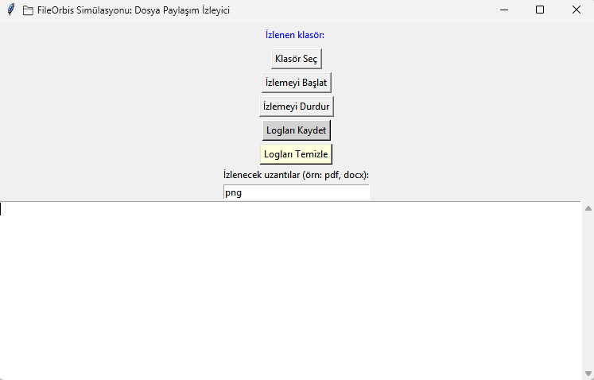
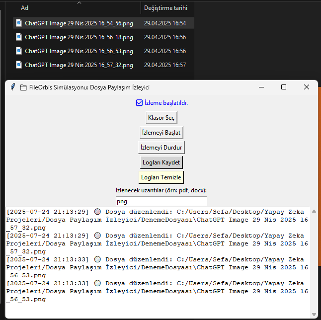

# 📁 FileOrbis Simülasyonu – Dosya Paylaşım İzleyici (Python + Tkinter)

Bu proje, belirli bir klasördeki dosya değişikliklerini (ekleme, silme, düzenleme, yeniden adlandırma) gerçek zamanlı olarak izleyen ve loglayan basit bir FileOrbis simülasyonudur.

## 🎯 Özellikler

- Gerçek zamanlı klasör izleme
- Dosya türü filtresi (örn: sadece .pdf veya .docx dosyaları)
- Tkinter GUI ile kullanıcı dostu arayüz
- Logları kaydetme (.txt olarak)
- Log ekranını sıfırlama
- Geri planda sorunsuz izleme (thread destekli)

## 🖥️ Ekran Görüntüsü

## 🚀 Başlangıç

**Gereksinimler**  
• Python 3  
• watchdog kütüphanesi (pip install watchdog)

**Kullanım Adımları**  
1. Uygulamayı çalıştırın  
2. Klasör seçin  
3. İzlenecek dosya uzantılarını yazın (örneğin: pdf, docx)  
4. İzlemeyi başlatın  
5. Logları izleyin, kaydedin veya temizleyin

## 🧠 Kullanım Senaryoları

- Paylaşımlı klasörlerin izlenmesi  
- Güvenlik amaçlı dosya takibi  
- Loglama pratiği edinmek  
- FileOrbis, JAMF, SCCM gibi altyapıların temellerini öğrenmek

## 👨‍💻 Not

Bu proje, uç nokta yönetimi (endpoint management) alanında beceri göstermek isteyen yeni başlayanlar için örnek bir simülasyon olarak tasarlanmıştır.
